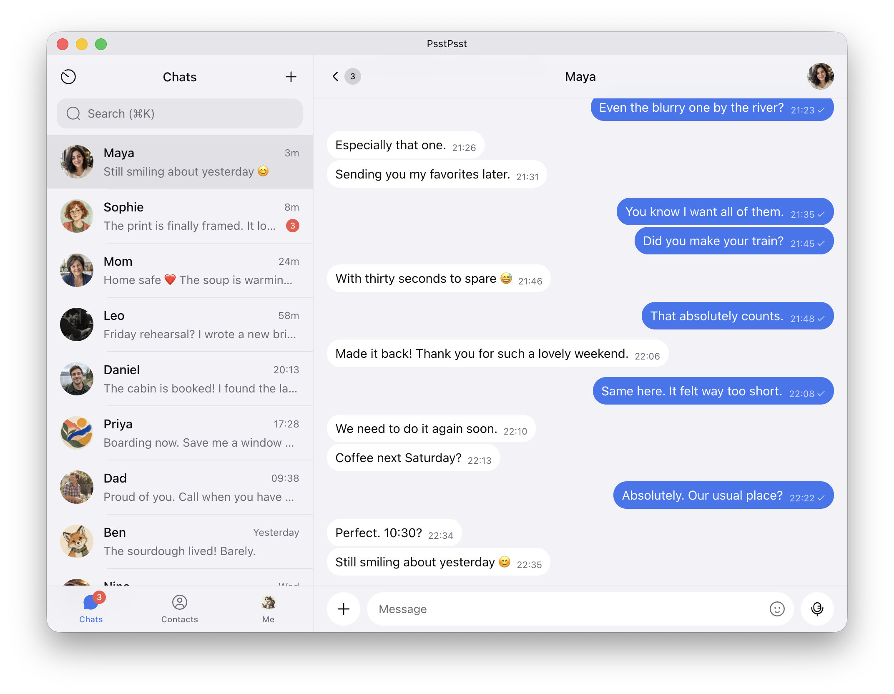
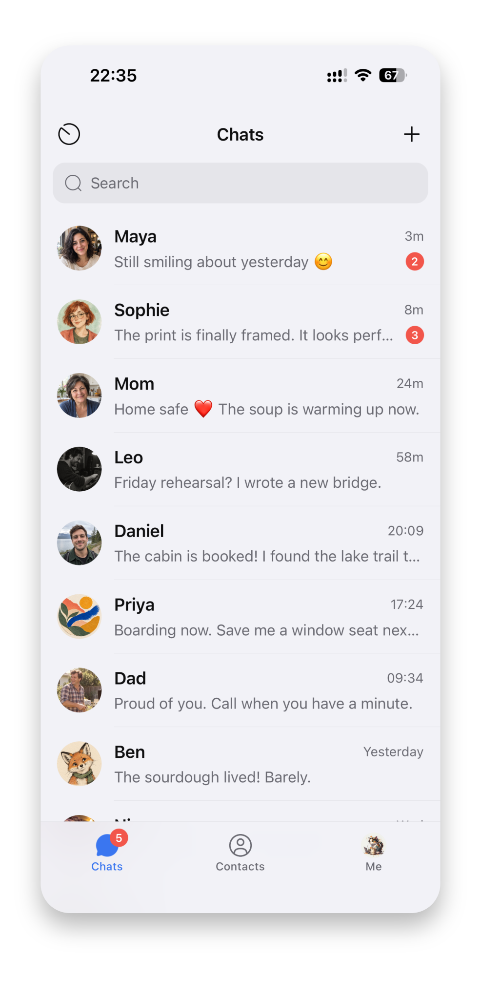

# PsstPsst

**Decentralized, end-to-end encrypted messaging. No phone number required.**

PsstPsst is a free, open-source messenger for iOS, Android, and desktop. Your
cryptographic keys are your account: get started without a phone number or
email address, and exchange encrypted messages over Nostr or nearby Bluetooth.

[Downloads](#downloads) · [Build from source](#build-from-source) ·
[Contribute](CONTRIBUTING.md) · [Privacy](https://psstpsst.chat/privacy/) · [Security](SECURITY.md)

<p>
  <picture>
    <source media="(prefers-color-scheme: dark)" srcset="docs/images/desktop-dark.png">
    <source media="(prefers-color-scheme: light)" srcset="docs/images/desktop-light.png">
    
  </picture>
  <picture>
    <source media="(prefers-color-scheme: dark)" srcset="docs/images/mobile-dark-framed.svg">
    <source media="(prefers-color-scheme: light)" srcset="docs/images/mobile-light-framed.svg">
    
  </picture>
</p>

## Downloads

The first public release is being prepared. Published installers and release
notes will be available on
[GitHub Releases](https://github.com/codytseng/psstpsst/releases).
Until then, use the source-build instructions below.

| Platform | Distribution target |
| --- | --- |
| Android | Universal APK |
| macOS | Apple Silicon DMG and ZIP |
| Windows | x64 and arm64 installers |
| Linux | x64 and arm64 AppImage and DEB |
| iOS | Build with Xcode; public distribution details will accompany a release |

This table describes the configured release targets, not store availability.
Check each release's notes for tested OS versions and known issues.

## Features

- **Private conversations:** end-to-end encrypted one-to-one text, media, files,
  voice messages, replies, reactions, and forwarding.
- **Keys as accounts:** no central account provider, phone number, or email
  requirement; optional Nostr names make people easier to find.
- **Nearby messaging:** exchange messages and files over Bluetooth Low Energy
  without Internet access, with compatible PsstPsst peers.
- **Connected wallets:** non-custodial Lightning wallet connections through
  Nostr Wallet Connect.
- **Mobile and desktop:** shared conversations UI with light and dark themes
  and layouts that adapt to the available space.

## Before you start

Back up your identity key and use the app's key-transfer and archive features
when moving devices. An identity-key backup alone does not guarantee recovery
of encrypted chat history. The [privacy policy](https://psstpsst.chat/privacy/)
is maintained on the official website.

- Messaging currently supports one-to-one conversations. The messaging-key
  extension requires compatible peers; support for Nostr alone does not
  guarantee private-message interoperability.
- Nearby requires Bluetooth permissions and hardware/OS support. On Windows and
  Linux, the adapter must support both BLE Central and Peripheral roles. Range,
  transfer speed, and background availability depend on the device.
- Notifications are best-effort. iOS background checks are scheduled by the OS;
  Android uses a foreground service and is subject to battery restrictions.
  Desktop background checks require the application to remain running.
- An ordinary browser is not a supported app runtime. React Native Web powers
  the Electron renderer; Expo Go cannot run the complete native application.

See [SECURITY.md](SECURITY.md) for vulnerability reporting and the documented
security review status.

## Build from source

Use Node.js 22 and npm. Mobile builds need the corresponding native toolchain;
Electron builds also compile a host-specific Bluetooth helper. See
[development setup](CONTRIBUTING.md#development-setup) for prerequisites,
Windows shell setup, and troubleshooting details.
On Windows, run the commands in Git Bash and use `npm --script-shell=bash run ...`
in place of `npm run ...`.

```bash
git clone https://github.com/codytseng/psstpsst.git
cd psstpsst
npm ci
```

The commands below build standalone apps with bundled JavaScript; no Metro
server is needed to run them. They use the production identity (**PsstPsst**,
`chat.psstpsst.app`). For development with Fast Refresh, use `npm start` plus
`npm run ios:dev` / `npm run android:dev`, or `npm run electron:dev`; see
[CONTRIBUTING.md](CONTRIBUTING.md#running-the-app).

### Android APK

```bash
npm run android:prebuild
npm run android:build
```

The universal APK is written to
`android/app/build/outputs/apk/release/app-release.apk`. Transfer it to an Android
device and open it to install, or use
`adb install -r android/app/build/outputs/apk/release/app-release.apk`.

This is a release-mode build, signed with the generated project's **debug key**
for local use. It is not signed with the official release key and cannot update
an installation signed with a different key. For your own distribution key, see
[Android signing](docs/RELEASING.md#android-developer-owned-apk-signing).

### iOS Release build

On macOS, configure your Apple development team in `expo.ios.appleTeamId` in
`app.json` and prepare signing for the app and share extension as described in
[iOS signing](docs/RELEASING.md#signing-configuration-and-archive), then run:

```bash
npm run ios:prebuild
npm run ios:build
```

Select a connected iPhone or a simulator. This compiles and installs a Release
build with bundled JavaScript. A physical device requires provisioning for the
app and share extension; a simulator build cannot be installed on an iPhone.

To create an archive after prebuild and signing setup:

```bash
npm run ios:archive
```

The result is `release/PsstPsst.xcarchive`. Open it in Xcode Organizer to export
an IPA for your provisioning method or distribute through App Store Connect.
An archive is not itself an installable IPA; see the
[iOS release guide](docs/RELEASING.md#signing-configuration-and-archive).

For both mobile platforms, run `*:prebuild` on initial setup and after changing
native configuration, plugins, dependencies, or the app environment. It replaces
the selected generated native directory, including manual edits. Keep lasting
native changes in app config, plugins, or local modules. Subsequent builds can
run `*:build` directly. To switch back to development, follow the
[development prebuild instructions](CONTRIBUTING.md#install).

### Desktop installers

Build on the target operating system.

```bash
npm run electron:package
```

Installers are written to `release/`: DMG and ZIP on macOS, NSIS installers on
Windows, and AppImage and DEB on Linux. This command packages for the host
architecture; CI builds the additional architectures listed above.

On macOS, this command disables certificate signing and notarization, so no Apple
release credentials are needed. The local package may be blocked by Gatekeeper.
For a signed distribution build, configure the credentials and use
`npm run electron:package:signed`; see
[RELEASING.md](docs/RELEASING.md#macos-developer-id-signing-and-notarization).

### Clean build outputs

To return dependencies and build outputs to a fresh-clone state, stop running
development servers and builds, then run:

```bash
npm run clean -- --dry-run # Preview what will be removed
npm run clean
npm ci # Reinstall when ready to develop again
```

The cleanup requires only Node.js and Git. It removes ignored dependencies,
generated `ios/` and `android/` projects (including manual edits inside them),
Expo and Electron outputs, local native-module build outputs, and build/test
caches. It preserves tracked files, other untracked source files, root `.env`
files, signing credentials outside generated directories, editor settings, and
app data. Global npm, Gradle, CocoaPods, and Xcode caches are left intact.

## Protocol and architecture

Private Nostr messages combine the
[NIP-4E proposal](https://github.com/nostr-protocol/nips/pull/1647), which separates
messaging encryption keys from identity keys, with
[NIP-17](https://github.com/nostr-protocol/nips/blob/master/17.md),
[NIP-44 v2](https://github.com/nostr-protocol/nips/blob/master/44.md), and
[NIP-59](https://github.com/nostr-protocol/nips/blob/master/59.md).
Nearby uses authenticated Noise sessions over BLE.

TypeScript, React Native, Expo SDK 56, SQLite, and Electron share a core behind
platform interfaces. UI, services, storage, and OS adapters have explicit
boundaries; conversation history is read in bounded windows. See the
[architecture guide](docs/ARCHITECTURE.md) for the full design.

## Contributing and documentation

Bug reports, focused fixes, translations, and documentation improvements are
welcome. Start with [CONTRIBUTING.md](CONTRIBUTING.md); discuss major features
with the maintainer before implementation. Report vulnerabilities through the
[security process](SECURITY.md).

- [Architecture](docs/ARCHITECTURE.md) and [design system](docs/DESIGN.md)
- [Builds and releases](docs/RELEASING.md)
- [Nearby messaging](docs/protocols/nearby-messaging.md) and
  [file transfer](docs/protocols/nearby-file-transfer.md)
- [Configuration publication](docs/protocols/configuration-publication.md),
  [notification recovery](docs/protocols/notification-recovery.md), and
  [NIP-05 registration](docs/protocols/nip05-registration.md)
- [Android QR scanner maintenance](docs/ANDROID_QR_SCANNER.md)
- [Third-party notice maintenance](docs/OPEN_SOURCE_NOTICES.md)

## License

PsstPsst is licensed under the [MIT License](LICENSE). Third-party components
retain their own licenses and copyright notices; see
[THIRD_PARTY_NOTICES.md](THIRD_PARTY_NOTICES.md) and the accompanying license files.
